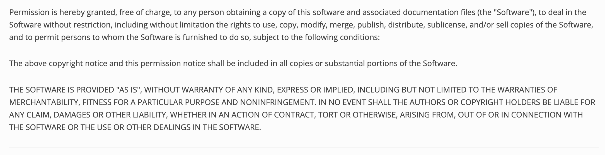

# Genesis README.md

    

## Description
    
    This is a README.md generator tool.
    Deployed github page: https://jshvaron.github.io/genesis-readme/
    Github Repo: https://github.com/jshvaron/genesis-readme

## Table of Contents

    
- [Installation](#installation) 
- [Usage](#usage) 
- [Licenses](#licenses) 
- [Contribute](#contribute) 
- [Testing](#testing) 
- [Questions](#questions)

    
## Installation
    
    Clone the repo, make sure you have  NPM and NPM Inquirer, then run this app through node  genesis.js.

## Usage

    Review the walkthrough video: https://drive.google.com/file/d/1-fGu8STmBgpno9Oq10kiqjBInZght6sj/view

## Licenses

    

MIT License

## Contribute

    Review the Questions section.

## Testing

    Run the app via node. 

## Questions
 

Please reach out to via Github: https://github.com/jshvaron or create an issue on the correlating repo page. For any further communication, please email me: snailmail@mail.com.

